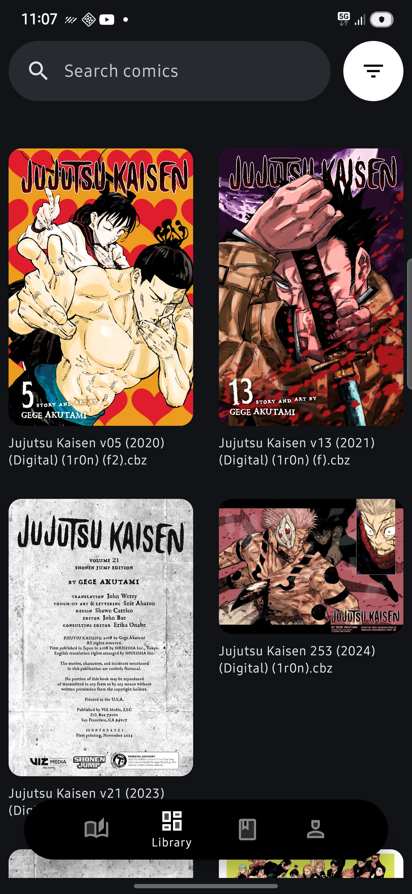

# Katuni reader app

## Hello 👋

I am building a **comic book reader app**.

My motivation for this came after switching devices from **iOS to Android**. I was not able to find an adequate comic book reader app — or rather, a comic book reader app that _I_ wanted to use.

---

## Features I Want in the App

- Ability to read most formats (**CBZ, PDF, EPUB**, etc.)
- A **clean UI** where my comics feel like they’re part of a digital collection
- Ability to read comics from a folder on my phone’s **local storage**
- Since I have comics in **PDF format**, I’d like to support **PDF annotations**, such as highlighting while reading

---

## Progress So Far

- Loading comics from local storage
- Searching through your library
- Reading comics _(some optimization still needed)_

---

## Work in Progress

- Thumbnail progress as you read through a comic
- Improved UI and animations
- Additional screens, such as:
  - **Reading Now**
  - **Highlights**
  - **Settings / Profile**

---

## Media

Here are a couple of screens and videos of my work on the app so far:

### Videos of the App

---
